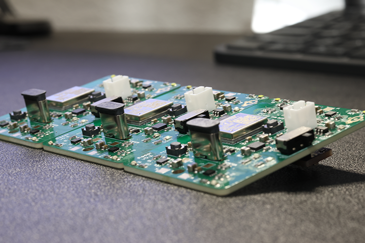
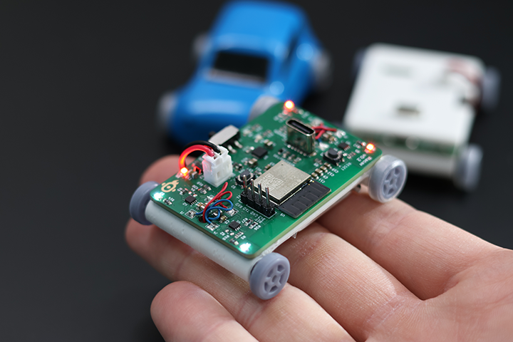

# Micro Racer Car - StuckAtPrototype

*thank you for the overwhelmingly positve support!! such an inspiration to keep making fun open source content!*

## New Youtube video about improvements 
Lots of new improvements and I am now selling a kit for these! Check out the video here:
https://www.youtube.com/watch?v=FulhEs5R5WU

## Original Youtube Video
A bit of a back-story of how this project came to be. 

Sub if you like what you see.

*Some pictures of the project*

## Hardware Remote for this car

https://github.com/StuckAtPrototype/Thumbtroller

## Project Structure
The project consists of
1. Firmware
2. Hardware
3. Mechanical 
4. Scripts

These are structured into their own files. I could have used submodules, but decided against it.  

### 1. Firmware
Code for the little car. This lives on the ESP32

#### Requirements
- ESP32 IDF version 5.3.1
- USB to Serial dongle
- Target set to ESP32-H2

### 2. Hardware

#### Schematic
PDF schematic included for your viewing pleasure. 
#### PCBs
All the gerber files you'd need to send to a fab house. 
#### Kicad
All the files you'd need to expand and work on this further. If you'd like. 

### 3. Mechanical

#### Enclosure
All the step files you need to make one of these. Extrusion printer works well for this part.  

#### Wheels
A bit of caution on this one.. you'll need an SLA printer. 

### 4. Scripts
Did anyone say neural networks? 

This folder has all the python code you'd need to train up your own neural network for the car. It also consists scripts that let you drive it using a keyboard -- just in case you dont want to make a physical controller.  

#### Requirements
- Python 3
- You'll need to install a bunch of pip modules 

#### Training the neural network
Training the neural network is as simple as running the training script with the data in the `color_data.txt` file. For data format see the sample data in the file. You need to stick to the formatting. 

To train run `python trainer.py`

#### Keyboard controller
To run the script `python controller.py`

Use `w` `s` `a` `d` for control. Modify the script for different speeds, etc

*Protocol for motor control* 

60,1,60,1,5 -- translates to:

motor side A: speed 60, direction forward

motor side B: speed 60, direction forward

500 miliseconds run time

See firmware file `motor.c` if you need more details

## What the project could use
1. Cleanup, but thats true for almost anything out there
2. Some fun code that makes the little car drive using the color sensor -- think very fancy line follower
3. LLM integration -- ChatGPT driving a physical little robot? anyone? :)

## If you take it further
Let me know if you ever make one of these, I'd love to see it. Seriously, that'd be exciting and inspiring to keep making my projects open source!

---
## License
### Apache 2.0 -- i.e. use as you'd like
http://www.apache.org/licenses/LICENSE-2.0

--- 
## Special Thanks
Thanks to Michael Angerer for his open sourced `esp32_ble_ota` project. I used it to get BLE running in this project. His blog post and github repo are a great resource. Check it out. https://github.com/michael-angerer/esp32_ble_ota 
